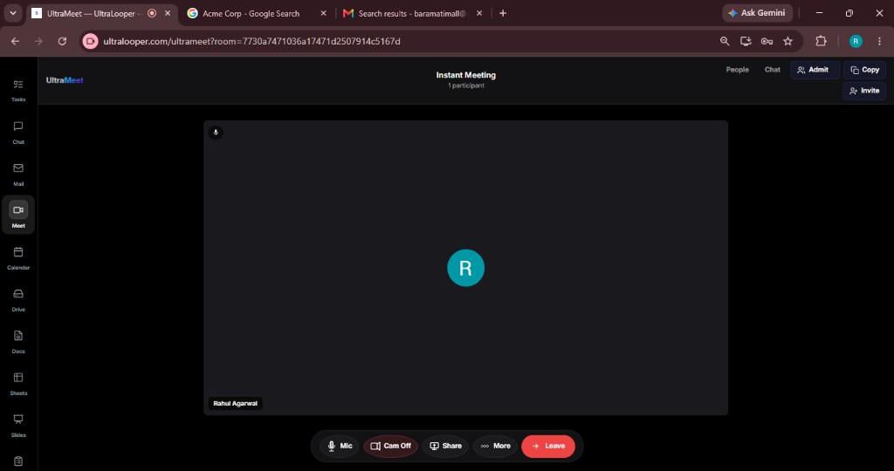

# SlayMeet

[](LICENSE)
[](https://github.com/13rahul/slaymeet/actions/workflows/ci.yml)
[](https://github.com/13rahul/slaymeet/releases)
[](https://ultralooper.com)

Self-hosted video meetings with **Teena**, an in-room AI assistant (wake word, Gemini brain, Piper TTS). Built on [LiveKit](https://livekit.io) (Apache-2.0). SlayMeet is not affiliated with LiveKit Inc.

Showcase: [ultralooper.com](https://ultralooper.com)



## Features

* Instant and scheduled video meetings (LiveKit SFU)
* In-room AI assistant **Teena** (wake word, chat, voice)
* Self-hosted Piper TTS by default (optional Gemini TTS)
* Screen share, chat, people / admit flow
* Docker Compose one-command local stack
* HTTP APIs for rooms, signaling, calls, and the agent
* Accessibility-minded — contributions that improve a11y are especially welcome

## Quick start (Docker)

```bash
cp .env.example .env
# Set GEMINI_API_KEY and SLAYMEET_BOT_SECRET in .env

docker compose up --build
```

1. Open http://localhost:8080/login  
2. Sign in: `admin@localhost` / `password` (change after first login)  
3. Open http://localhost:8080/meet — instant room is created  
4. Click **Ask AI** and say **"Hey Teena"**

## Environment

| Variable | Required | Description |
|----------|----------|-------------|
| `LIVEKIT_URL` | Yes | Browser WebSocket URL (e.g. `ws://localhost:7880`) |
| `LIVEKIT_API_KEY` | Yes | Must match `deploy/livekit/livekit.yaml` |
| `LIVEKIT_API_SECRET` | Yes | JWT signing secret |
| `SLAYMEET_BOT_SECRET` | Yes | HMAC secret for AI bot tokens |
| `GEMINI_API_KEY` | For Teena brain | Google Gemini API key |
| `SLAYMEET_TTS_ENGINE` | No | `piper` (default) or `gemini` |
| `SLAYMEET_PIPER_*` | For local TTS | See Piper TTS notes in `deploy/ULTRAMEET_PIPER.md` |

## Teena (AI agent)

- **Brain:** Gemini (`agent_respond.php`) — bring your own API key  
- **Voice:** Piper TTS by default (`agent_tts.php`) — self-hosted, no cloud TTS required  
- **Wake word:** "Teena" (configurable in `slaymeet-agent.js`)

Install Piper:

```bash
bash deploy/install-piper-tts.sh   # Linux
# or
powershell deploy/install-piper-tts.ps1   # Windows
php scripts/verify-piper-tts.php
```

## Project layout

```
app/SlayMeet/          # Domain + APIs + Speech (canonical code)
public/api/slaymeet/   # Thin stubs → app/SlayMeet/Http/Api/
public/meet.php        # Meeting UI
deploy/livekit/        # LiveKit server config
database/schema.sql    # MySQL schema
```

## API

All endpoints under `/api/slaymeet/` — room lifecycle, signaling, calls, Teena (`invite_agent`, `agent_respond`, `agent_tts`).

## UltraLooper (hosted suite)

Want branding, CRM, Workplace apps, and managed Meet without running Docker yourself?  
**[UltraLooper](https://ultralooper.com)** is the commercial suite built around this engine (similar role to Jitsi’s JaaS).

## Security

Report issues per [SECURITY.md](SECURITY.md). Rotate `SLAYMEET_BOT_SECRET` and default admin password before production.

## Contributing

See [CONTRIBUTING.md](CONTRIBUTING.md) and our [Code of Conduct](CODE_OF_CONDUCT.md).  
Bug and feature templates are available when you open an issue. Accessibility improvements are especially welcome.

SlayMeet is built by a **half-blind founder** — we design and prioritize so more people can use meetings and AI tools with confidence.

## License

Apache-2.0. Copyright 2026 Fundaking Media OPC Pvt Ltd. See [LICENSE](LICENSE) and [NOTICE](NOTICE).

---

Built with care by a half-blind founder at [Fundaking Media](https://ultralooper.com) and the community.
